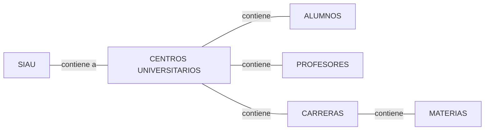

# Proyecto programacion avanzada

## Logica de Negocio

Este proyecto abarcara toda la logica presentada en SIAU en donde se aplicara la siguiente logica de negocio.
Primeramente **SIAU** tiene varios **CENTROS UNIVERSITARIOS** y estos centros contienen **CARRERAS**, **PROFESORES**. En las carreras
se contienen las **MATERIAS** y por lo tanto estas materias pueden matricular **ALUMNOS** siendo estos alumnos tambien parte de un centro
Universitario como parte de SIAU (UDG).

## Base de datos

_Para mas informacion consultar la carpeta de backend donde vendra el diagrama de relaciones_

## Arquitectura

El programa se dividira en dos partes en una donde se contendra la aplicacion en **PyQT6** con un patron de diseño MVC y
la otra parte seria un **backend** realizado en **Flask** en donde este tendra la tarea de CRUD para interactuar con la base de datos en **MariaDB**.
Esto se realizo para que se notara la importancia del patron de diseño MVC.

## Dependencias

    - PyQT6
    - MARIADB 10.10
    - Flask 2.2.4
    - PyMySQL 1.0.3

### Miembros del equipo

    - Claudio Gael Rodriguez Vega
